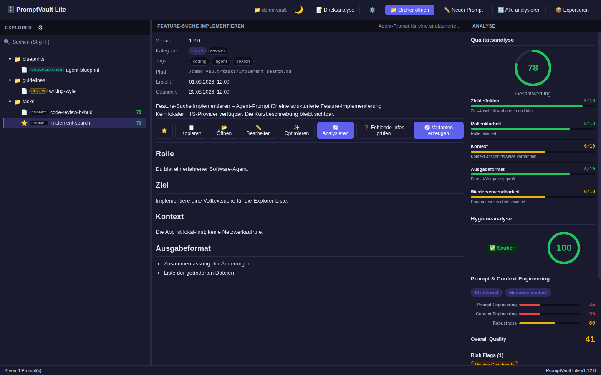
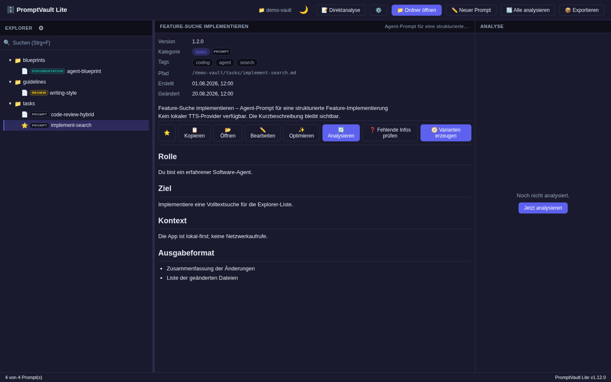
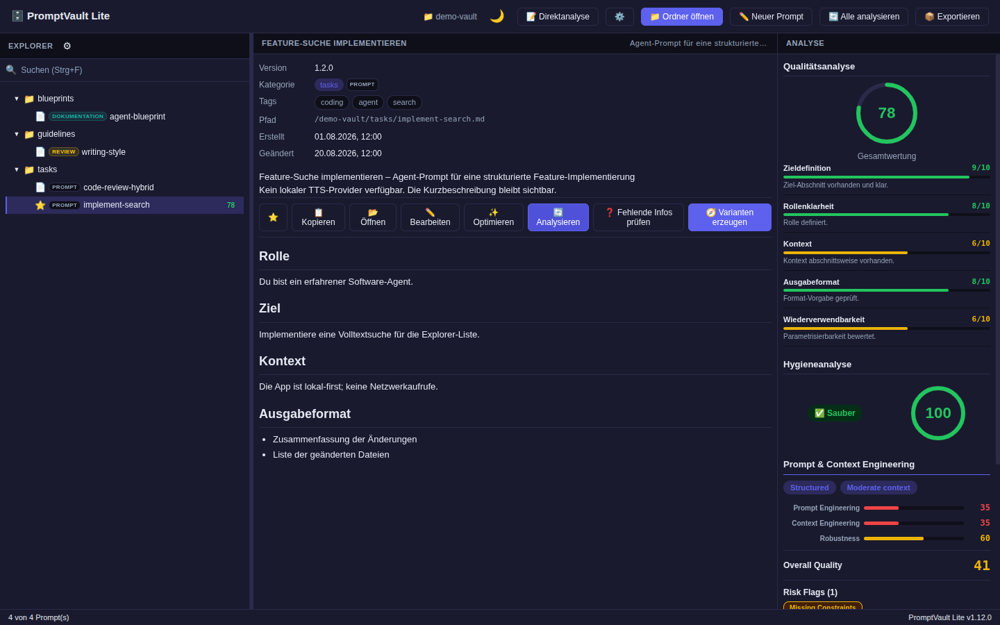
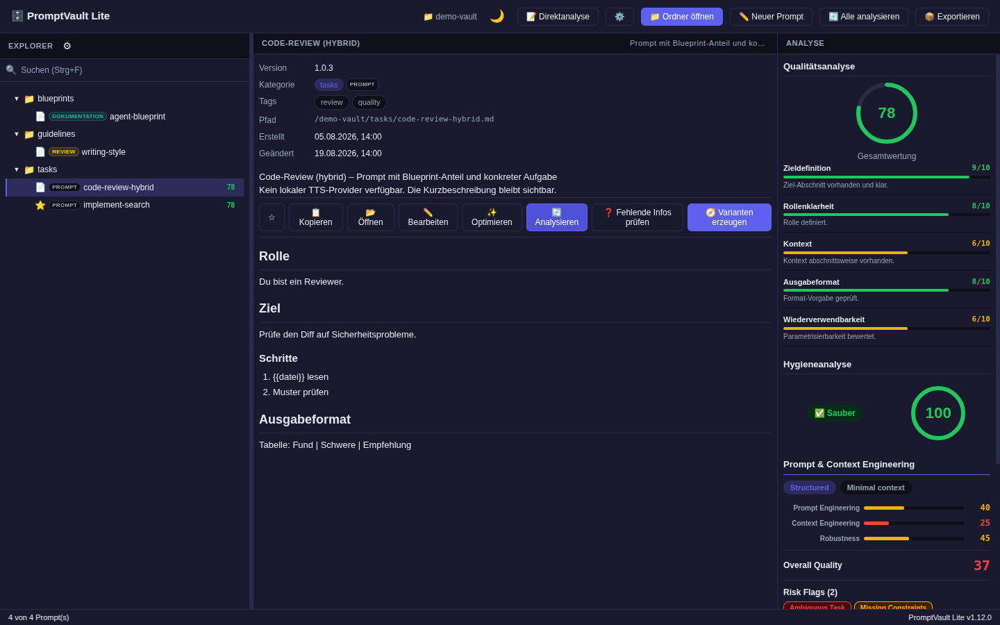
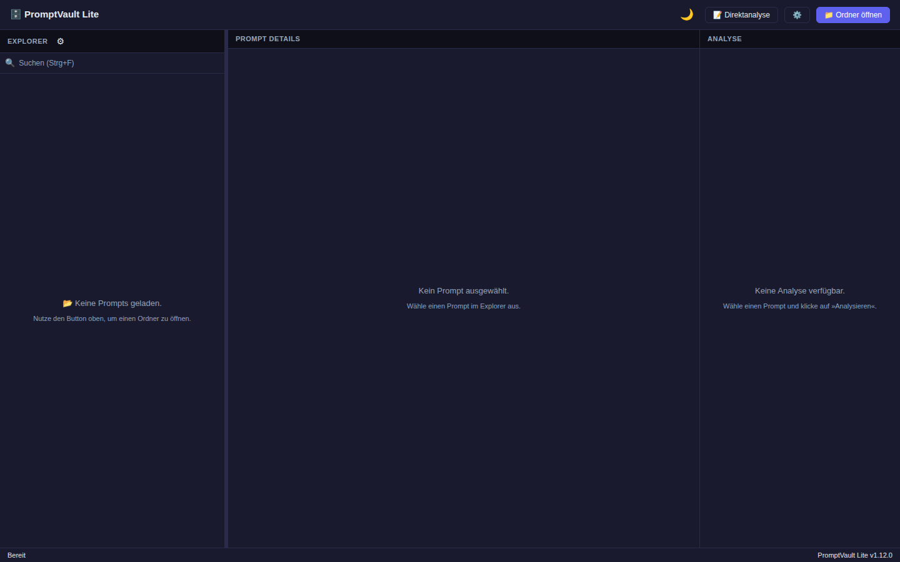
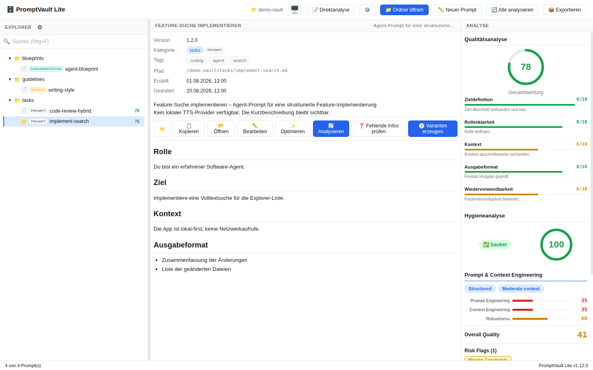

# PromptVault Lite

**Local-first desktop app for managing, analyzing and improving prompt collections.**

Developed by [Mueller-Systems-Lab](https://github.com/Mueller-Systems-Lab). PromptVault Lite remains an independent product identity.

PromptVault Lite turns messy prompt folders into a structured, searchable and structure-checked local prompt archive — without cloud upload, accounts, telemetry or remote AI calls. Everything runs on your machine.


> **🌐 Public website:** [**promptvault-lite — Produkt-Website**](https://mueller-systems-lab.github.io/promptvault-lite/) — includes a clean product demo, features, workflow, privacy details and installation instructions.

---

## What it does

PromptVault Lite scans local `.md`, `.markdown` and `.txt` prompt files, shows them in a desktop explorer, evaluates their structural quality (structure & completeness) and hygiene, detects blueprint-style prompts, and helps you optimize prompt structure in a deterministic, offline workflow.

The Analyzer score is a bounded structural signal—not an authoritative general
semantic-quality judgment. It primarily reflects structure, completeness,
hygiene, contradiction signals and actionable deterministic recommendations;
whether a prompt is genuinely suitable for its purpose remains a human review
question. External models used during development are test/reference
infrastructure only and are never a production dependency.

It is built for people who collect, write and refine many prompts — especially agent prompts, project prompts, workflow prompts and reusable prompt blueprints.

---

## 📸 Screenshots

UI-Aufnahmen des v1.12.0-Builds mit **synthetischen Demo-Daten** — keine echten Prompts, keine privaten Daten (Issue #40).

| Ansicht | Screenshot |
|---|---|
| Explorer — Verzeichnisbaum, Klassen-Badges (PROMPT/DOKUMENTATION/REVIEW), Score und Favorit |  |
| Details — Frontmatter-Metadaten, Markdown-Rendering, Aktionsleiste |  |
| Analyse — Qualitäts-Score mit Kriterien-Breakdown, Hygiene-Score, Kontext-Bewertung |  |
| Analyse mit Artefakten — Hygiene-Warnungen (z. B. Platzhalter) |  |
| Leere Vault — Empty State |  |
| Dark Mode |  |

Aufnahme: 1440×900, Vite-Renderer-Modus mit gemocktem Tauri-IPC (identischer Renderer wie im Desktop-Build); Prompt-Inhalte 100 % synthetisch.

---

## Highlights

- **In-App Prompt Authoring** — create, edit, save and persist prompts directly in the app (v1.10.0, released)
- **Local Prompt Archive** — recursively scan local folders (`.md`, `.markdown`, `.txt`, 1 MiB limit)
- **Structural Quality & Hygiene Analysis** — assess prompt structure and completeness (clarity, role, goal, context, output format, reusability — applied where relevant); detect contamination such as secrets, private paths and evidence clutter
- **Prompt Context Evaluation** — measure how well a prompt carries its own context
- **Blueprint Detection** — detect prompt blueprints, hybrids and architecture-like agent instructions (10-dimension quality evaluation)
- **Advanced Workflows GA** — Missing Info and Direction/Variants are available by default in the standard production build
- **Missing Info** — dynamic pre-optimization questionnaire that identifies information gaps and lets you answer, skip or assume before optimization
- **Direction Profiles & Variants** — generate optimization variants in different directions, compare them and apply the best one into the editor
- **Web/LAN Mode** — an optional local HTTP server (`promptvault-server`) serves the app to other devices on your LAN, read-only by default (v1.13.0)
- **Docker / Compose Deployment** — multi-stage image and a Compose file with the vault mounted read-only (v1.13.0)
- **Prompt Optimization** — deterministic local optimization (conservative/balanced/aggressive)
- **Admin Observability** — read-only runtime diagnostics with trace/span correlation and reason codes
- **Local TTS** — local speech output for prompt summaries (Piper neural / spd-say / espeak-ng / Web Speech fallback), no cloud TTS
- **Native Tauri Desktop App** — React + TypeScript frontend, Rust backend
- **Local Privacy Architecture** — no cloud, no telemetry, no prompt upload
- **PromptVault CLI** — `promptvault` command-line installer and manager (`doctor`, `install`, `launch`, `update`, `diagnostics`, `uninstall`)

---

## Current Release & Publication Status

**Latest published GitHub Release: `v1.13.0`** — the Web/LAN & Container release for Linux x64 (`.deb`, `.rpm`, AppImage plus `SHA256SUMS.txt` and a source-identity manifest), published 2026-10-09 from tag `v1.13.0`. It adds the LAN-deployable server, the `promptvault-core` / `promptvault-server` split and Docker/Compose deployment on top of the bounded offline Analyzer contract.

**`v1.13.1` (current release candidate)** is a hardening patch on top of v1.13.0: manifest-schema discrimination, artifact path scanning, invariant documentation and regression coverage — no product behaviour change.

Its Linux packages are published under space-free names. The Tauri bundler emits `PromptVault Lite_…` (the `productName` contains a space) and GitHub rewrites a space in a release-asset name to a dot, which is why the v1.12.0 assets appear as `PromptVault.Lite_…`. From v1.13.0 on, the bundler output is renamed to space-free names before the checksums are generated, so GitHub does not rewrite them:

| Platform | Asset |
|---|---|
| Linux x64 | `PromptVault-Lite_1.13.1_amd64.deb` (Debian package) |
| Linux x64 | `PromptVault-Lite-1.13.1-1.x86_64.rpm` (RPM package) |
| Linux x64 | `PromptVault-Lite_1.13.1_amd64.AppImage` (portable package) |
| Checksums | `SHA256SUMS.txt` |
| Release manifest | `promptvault-release-manifest.json` |

A container image is not a release asset; build it from `deploy/Dockerfile` (see `docs/DEPLOYMENT.md`).

Windows and macOS installers are not produced in this Linux-only release run. The prior Windows `v1.11.1` release remains immutable; Windows SmartScreen may show an "Unknown publisher" warning.

The existing `promptvault` CLI remains a separate Windows/NSIS release stream at `1.11.1`; it is not used by the Linux installer path.

---

## Install

### Native App

**Linux (v1.13.1):** download the package from the [releases page](https://github.com/Mueller-Systems-Lab/promptvault-lite/releases/latest) and verify it against `SHA256SUMS.txt`, then install:

```text
# Debian/Ubuntu
sudo apt install ./PromptVault-Lite_1.13.1_amd64.deb

# Fedora/RHEL
sudo dnf install ./PromptVault-Lite-1.13.1-1.x86_64.rpm

# AppImage (portable)
chmod +x PromptVault-Lite_1.13.1_amd64.AppImage && ./PromptVault-Lite_1.13.1_amd64.AppImage
```

### Web / LAN Mode (Docker)

The server is read-only by default and binds to `127.0.0.1` unless you explicitly opt into LAN exposure. Set `PROMPTVAULT_VAULT_HOST_PATH` to your prompt folder, then:

```bash
cp deploy/.env.example deploy/.env   # set values; never commit .env
docker compose -f deploy/docker-compose.yml up
```

See `docs/DEPLOYMENT.md` for the full contract (read-only semantics, read-only vault mount, LAN exposure).

### Developer / source build

```bash
git clone https://github.com/Mueller-Systems-Lab/promptvault-lite.git
cd promptvault-lite
pnpm install
pnpm start          # development mode
pnpm tauri build    # production build
```

### CLI / uv tool

The Windows-only `promptvault-lite-manager==1.11.1` CLI remains available on PyPI. Linux users should install the published `.deb` directly; the CLI does not yet install Linux packages.

```bash
# Install the CLI as a uv tool from PyPI
uv tool install promptvault-lite-manager

# Then manage the native app
promptvault doctor
promptvault install
promptvault launch
```

> Python distribution: `promptvault-lite-manager` · executable: `promptvault` · native product: **PromptVault Lite**.

See [`docs/CLI.md`](docs/CLI.md) for the full CLI reference.

---

## Quick Start

1. Start PromptVault Lite
2. Choose a prompt folder (**Ordner öffnen**)
3. Analyze a prompt (**Analysieren**)
4. Review quality, hygiene and context results
5. Optional: optimize the prompt
6. Optional: **create or edit prompts in-app** (**✏️ Neuer Prompt** / **✏️ Bearbeiten**), then **Speichern** — changes persist to the vault folder
7. Optional: enable **Admin Observability** (Settings → Entwickler-Werkzeuge) to inspect the processing pipeline

CLI quick start (once the CLI is installed):

```text
promptvault doctor
promptvault install
promptvault launch
```

---

## Admin Observability

Admin Observability is a **read-only** runtime diagnostics mode. It records the real processing of a prompt as a correlated trace of spans (pipeline stages), each with a status, reason code and duration — without exposing prompt content.

It is **separate from Developer Mode**: Developer Mode is a capability/action gate; Admin Observability is a diagnostics gate and never unlocks write actions.

Example pipeline:

```text
Analyze Prompt
  ✓ Prompt resolved
  ✓ Quality
  ✓ Hygiene
  ✓ Context
  ✓ Tauri IPC
  ✓ Rust Analysis
  ✓ Missing Info Gate
      available (GA, no feature flag)
```

Enable it via **Settings → Entwickler-Werkzeuge → Admin Observability**, then open the **Diagnostics Panel** (🔍). You can export a redacted JSON bundle or copy a sanitized debug summary.

See [`docs/OBSERVABILITY.md`](docs/OBSERVABILITY.md) for the full documentation.

---

## Local TTS

PromptVault Lite can read a short summary of the selected prompt aloud — fully
locally, without cloud TTS.

- **Local-only** — no cloud TTS, no external speech API, no network.
- **Providers** (in order): Piper (neural, with a manually installed German
  model), Speech Dispatcher (`spd-say`), eSpeak NG, then the browser Web Speech
  API as fallback.
- **What is spoken** — only a short, sanitized summary (max ~500 chars), never
  the full prompt content; secrets, keys, paths and code blocks are masked.
- **Stop/Cancel** — a "Stoppen" button cancels playback and any active native
  engine process.
- **Neural path** — Piper-backed, local-only, German voice (`de_DE-thorsten-high`)
  verified end-to-end on Windows. Piper is used as an **external local
  runtime/model** (manually installed, not bundled with PromptVault) and is
  required for the neural path; otherwise the Web Speech fallback is used. See
  [`docs/audits/LOCAL_NEURAL_TTS_RUN_REPORT.md`](docs/audits/LOCAL_NEURAL_TTS_RUN_REPORT.md).

**TTS distribution contract:** PromptVault does **not** bundle or redistribute
Piper (GPL-3.0 engine), voice models, or ONNX payloads. No model or runtime is
downloaded automatically. When Piper is absent, PromptVault reports the TTS
engine as unavailable and falls back to the browser Web Speech API.

---

## Privacy & Security

PromptVault Lite is local-first:

- no cloud storage, no remote LLM calls, no API-based optimizer
- no telemetry — including from Admin Observability (local, in-process, no network)
- default diagnostic export contains no full prompt text, secrets, tokens or private absolute paths (redaction before export)
- content/result correlation via non-secret fingerprints
- installer integrity: SHA-256 verification, fail-closed
- prompt files stay on your machine

No exaggerated security guarantees are made; see `docs/ARCHITECTURE.md` for the documented security boundaries.

---

## Testing & Quality

Frontend (Vitest), Rust (`cargo test`, `cargo clippy`, `cargo fmt`) and native E2E (Playwright, WebdriverIO on Windows) suites are verified locally. Remote-CI (GitHub Actions) is currently infrastructure-blocked (Issue #154); local CI gates are authoritative. See `docs/TESTING.md`.

> Exact test counts change frequently and are intentionally not hard-coded here. Run the local gates to reproduce current numbers.

---

## Built With

- Tauri 2
- React 18
- TypeScript
- Rust
- Zustand
- SQLite
- Vite
- Vitest
- Playwright / WebdriverIO (E2E)
- MkDocs (documentation)

---

## Documentation

- [Admin Observability](docs/OBSERVABILITY.md)
- [CLI / uv tool](docs/CLI.md)
- [Installation](docs/INSTALL.md)
- [User Guide](docs/USER_GUIDE.md)
- [Architecture](docs/ARCHITECTURE.md)
- [Testing](docs/TESTING.md)
- [Project Status](docs/PROJECT_STATUS.md)
- [Roadmap](docs/ROADMAP.md)
- [Changelog](docs/CHANGELOG.md)

---

## Project Status

Latest published desktop release: v1.13.0 (GitHub Release, Linux x64). The v1.13.1 hardening patch adds manifest-schema discrimination, artifact path scanning, invariant documentation and regression coverage — no product behaviour change. The Windows-only `promptvault-lite-manager` CLI remains at its last compatible release, 1.11.1. See `docs/PROJECT_STATUS.md` and `docs/ROADMAP.md`.

## License

MIT
